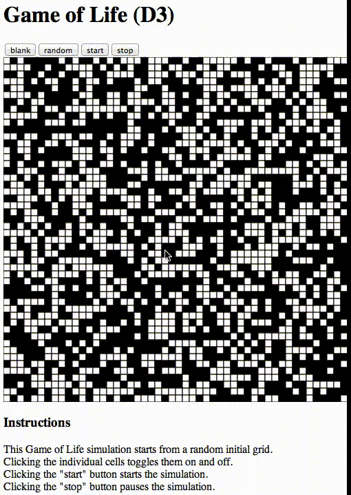

## Game of Life in Javascript

This is a minimal implementation of Conway's Game of Life, for the purposes of exploring 
different Javascript user interface frameworks.  

So far there are implementations using:
- native Javascript graphics (HTML5 canvas)
- D3.js (SVG)
- React.js (SVG)  


### Installation

Clone this repo:

```bash
[rule146@rule146: code]$ git clone https://github.com/jskelcy/life.git
Cloning into 'life'...
remote: Counting objects: 178, done.
remote: Compressing objects: 100% (124/124), done.
remote: Total 178 (delta 70), reused 147 (delta 53)
Receiving objects: 100% (178/178), 259.97 KiB | 0 bytes/s, done.
Resolving deltas: 100% (70/70), done.
Checking connectivity... done.
[rule146@rule146: code]$ cd life/
```

Check out the branch with the implementation you're interested in. To see the HTML5 canvas implementation check out the 'canvas' branch:

```bash
[rule146@rule146: life]$ git checkout canvas
Switched to branch 'canvas'
Your branch is up-to-date with 'origin/canvas'.
```

For the d3.js implementation, check out the 'd3' branch:

```bash
[rule146@rule146: life]$ git checkout d3
Switched to branch 'd3'
Your branch is up-to-date with 'origin/d3'.
```

The react.js implementation is (currently) on the 'master' branch:

```bash
[rule146@rule146: life]$ git checkout master
Switched to branch 'master'
Your branch is up-to-date with 'origin/master'.
```

Start a local http server in this repo (here I'm using port 8000) and open localhost in chrome:

```bash
[rule146@rule146: life]$ python -m SimpleHTTPServer 8000 &
[1] 3548
[rule146@rule146: life]$ Serving HTTP on 0.0.0.0 port 8000 ...
[rule146@rule146: life]$ open -a /Applications/Google\ Chrome.app/ http://localhost:8000
```

You should see a grid and some buttons for controlling the update animation:


Here's what the animation looks like:



### Project page

See the project page [here](http://jskelcy.github.io/life/).
